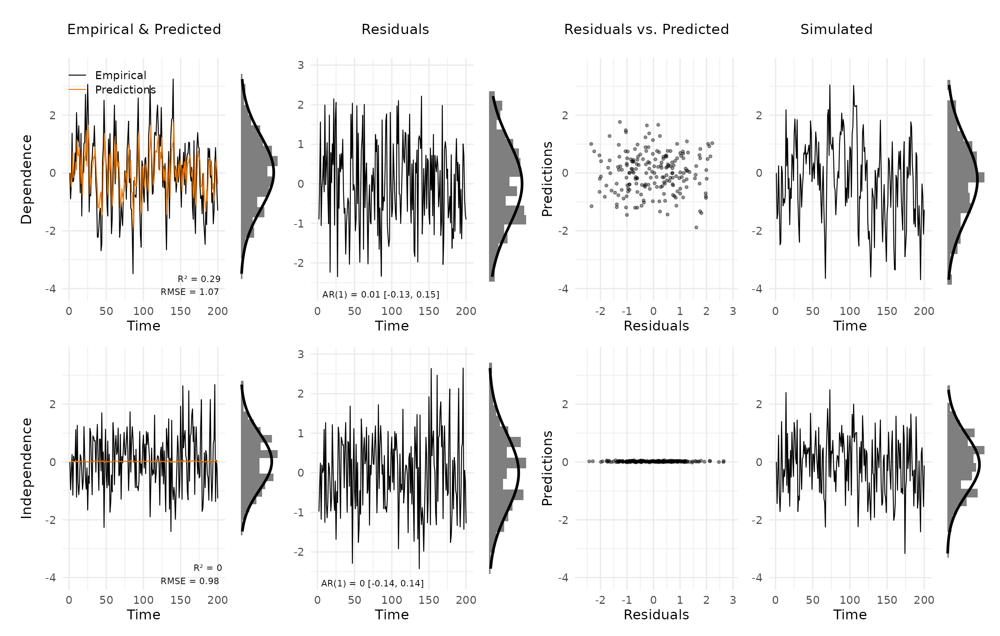
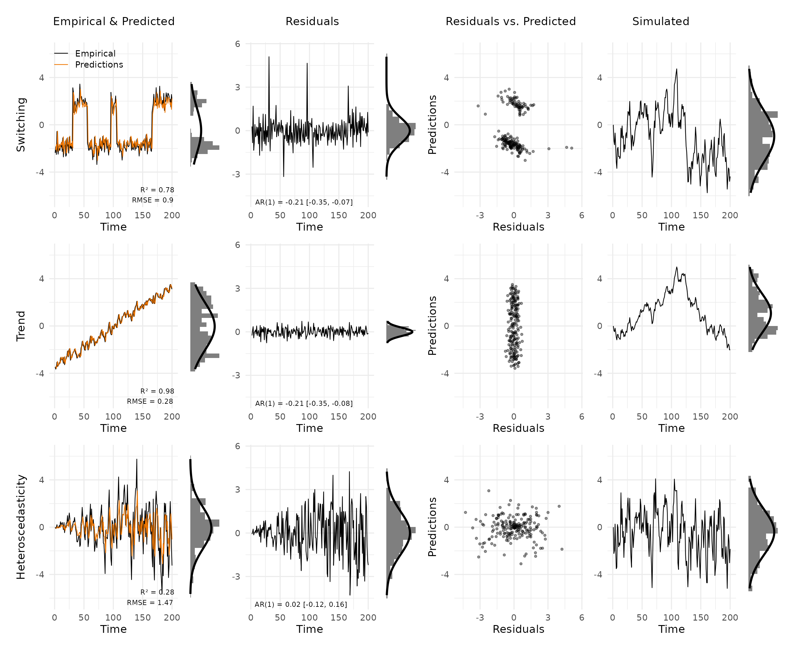
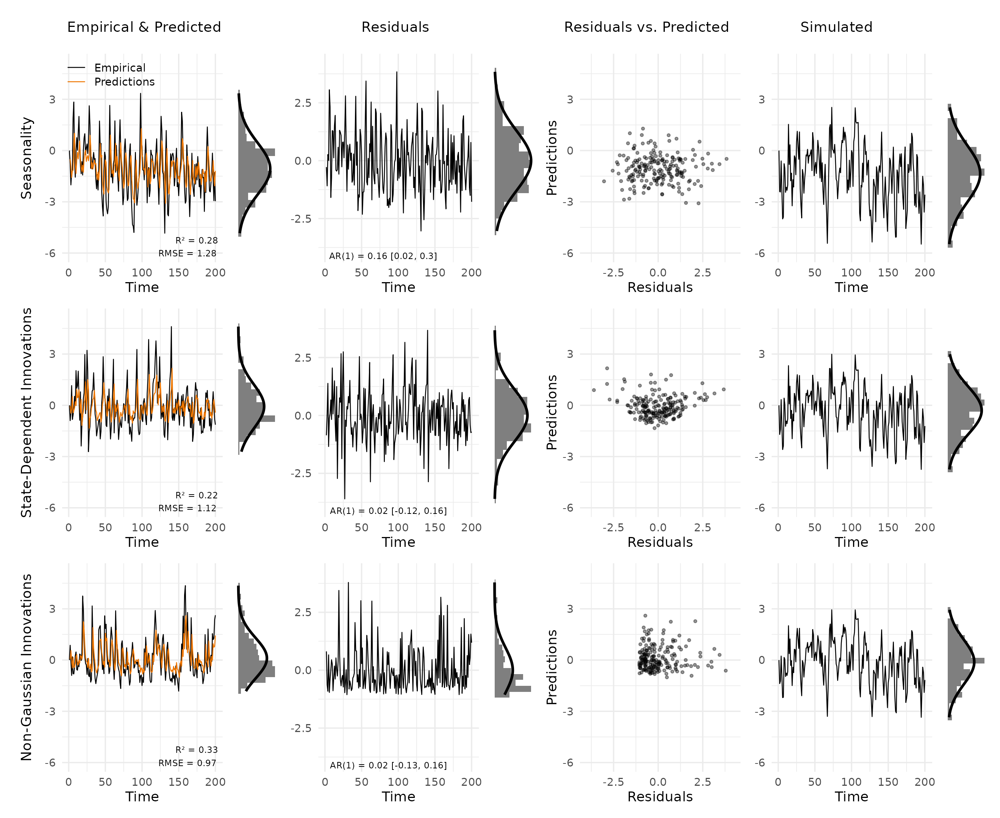

# Example analyses

This vignette reproduces the simulated examples from Haslbeck et
al. (2026), which use AR(1) processes to illustrate what each type of
model misfit looks like in the diagnostic grid. Eight data-generating
models (DGMs) are considered: two correctly specified and six
misspecified.

``` r

library(VARcheck)
```

## Helper functions

Two short functions stand in for a full modelling package: one fits an
AR(1) model and returns predictions and residuals, the other simulates a
new trajectory from the fitted model for the posterior predictive panel.

``` r

fit_ar1 <- function(x) {
  n     <- length(x)
  mod   <- lm(x[-1] ~ x[-n])
  xhat  <- c(NA, predict(mod))
  res   <- x - xhat
  list(mod = mod, xhat = xhat, res = res, res_var = sd(res, na.rm = TRUE))
}

sim_ar1 <- function(fit, n, seed = 92) {
  b    <- fit$mod$coefficients
  xsim <- numeric(n)
  set.seed(seed)
  for (i in 2:n) xsim[i] <- b[1] + b[2] * xsim[i - 1] + rnorm(1, 0, fit$res_var)
  xsim
}
```

## Generate data and fit AR(1)

In the following, we simulate eight different data-generating mechanisms
for which an AR model is either correctly specified (DGMs 1-2) or
misspecified in a particular way (DGMs 3-8). We stick to the AR model
for simplicity and interpretability, but the same workflow applies to
any VAR model fitted with your preferred package. The key point is that
the diagnostic grid takes the outputs of your existing workflow and
turns them into a structured plot; it does not fit models itself.

Specifically, we simulate the following processes:

- DGM 1: correctly specified, AR \> 0
- DGM 2: correctly specified, AR = 0 (white noise)
- DGM 3: linear trend
- DGM 4: state switching / non-linear
- DGM 5: heteroscedasticity (growing innovation variance)
- DGM 6: seasonality (weekend effect)
- DGM 7: state-dependent innovations
- DGM 8: non-Gaussian innovations (exponential)

``` r

N <- 200

# DGM 1: correctly specified, AR > 0
set.seed(2)
x1 <- numeric(N)
for (i in 2:N) x1[i] <- 0.6 * x1[i - 1] + rnorm(1)

# DGM 2: correctly specified, AR = 0 (white noise)
set.seed(3)
x2 <- numeric(N)
for (i in 2:N) x2[i] <- rnorm(1)

# DGM 3: trend
set.seed(2)
x3 <- numeric(N); x3[1] <- -15
for (i in 2:N) x3[i] <- 0.6 * x3[i - 1] + rnorm(1) - 6 + 0.06 * i
x3 <- (x3 / sd(x3)) * 2

# DGM 4: switching / non-linear
x4 <- c(rep(-2, 30), rep(2, 25), rep(-2, 40), rep(2, 10),
        rep(-2, 60), rep(2, 35)) + rnorm(N, sd = 0.5)

# DGM 5: heteroscedasticity (growing innovation variance)
set.seed(2)
x5 <- numeric(N)
for (i in 2:N) x5[i] <- 0.6 * x5[i - 1] + rnorm(1, sd = 0.1 + 0.012 * i)

# DGM 6: seasonality (weekend effect)
set.seed(4)
weekend <- rep(c(rep(0, 5), rep(1, 2)), 29)[1:N]
x6 <- numeric(N)
for (i in 2:N) x6[i] <- -1 + 2 * weekend[i] + 0.6 * x6[i - 1] + rnorm(1)

# DGM 7: state-dependent innovations
set.seed(2)
x7 <- numeric(N)
for (i in 2:N) x7[i] <- 0.6 * x7[i - 1] + rnorm(1, sd = 1 + 0.3 * x7[i - 1])

# DGM 8: non-Gaussian innovations (exponential)
set.seed(2)
x8 <- numeric(N)
for (i in 2:N) x8[i] <- -1 + 0.6 * x8[i - 1] + rexp(1)

# Fit AR(1) to each DGM
fits <- lapply(list(x1, x2, x3, x4, x5, x6, x7, x8), fit_ar1)
sims <- lapply(fits, sim_ar1, n = N)
```

## Correctly specified models

We combine the two correctly specified models. `new_var_data` accepts
multiple vectors of empirical data, predictions, residuals, and
simulations as separate columns. The `var_names` argument allows us to
label each column for the plot annotation.

``` r

vd_correct <- new_var_data(
  empirical = cbind(x1, x2),
  predicted = cbind(fits[[1]]$xhat, fits[[2]]$xhat),
  residuals = cbind(fits[[1]]$res,  fits[[2]]$res),
  simulated = cbind(sims[[1]],      sims[[2]]),
  var_names = c("Dependence", "Independence")
)

plot_var_check(vd_correct)
```



Both models are correctly specified. Empirical and predicted values
track closely for the first case, R² is substantial for the
autoregressive case and near zero for the white-noise case — as
expected, since an AR(1) model cannot improve on the mean when the true
autocorrelation is zero. The predictions in the second case are close to
zero. The estimate of the autocorrelation is close to its true value of
zero, so we essentially predict with the mean, which here is zero.
Residuals in both rows appear as white noise: the AR(1) annotation is
close to zero and the marginal histograms align with the Gaussian
overlay. Simulated trajectories are visually indistinguishable from the
empirical data.

## Main misspecifications

We first combine the three most common misspecifications into a single
plot to show how they differ from the correctly specified cases. Each of
these misspecifications violates a different assumption of the AR(1)
model, and therefore produces a distinct pattern in the diagnostic grid.

``` r

vd_main <- new_var_data(
  empirical = cbind(x4, x3, x5),
  predicted = cbind(fits[[4]]$xhat, fits[[3]]$xhat, fits[[5]]$xhat),
  residuals = cbind(fits[[4]]$res,  fits[[3]]$res,  fits[[5]]$res),
  simulated = cbind(sims[[4]],      sims[[3]],      sims[[5]]),
  var_names = c("Switching", "Trend", "Heteroscedasticity")
)

plot_var_check(vd_main)
```



**Switching.** The data alternates between two discrete levels. The
AR(1) model tracks the average of each state but fails at transitions,
producing large residual spikes. The residual histogram is clearly
bimodal — a strong departure from the Gaussian overlay. The scatter plot
reveals two clusters offset from the origin. Simulated data is unimodal
and continuous, unlike the step-function empirical series.

**Trend.** A linear trend is present in the empirical series but lies
outside the AR(1)’s stationary framework. The residual panel shows a
systematic drift over time rather than noise. The AR(1) coefficient of
the residuals is notably elevated, and the simulated trajectory shows no
trend — making the mismatch between simulated and empirical immediately
apparent.

**Heteroscedasticity.** Innovation variance grows over time. Early time
points are well fitted but the model underestimates variability later in
the series. The residual panel shows a widening spread from left to
right. The scatter plot reflects a funnel shape, with larger absolute
residuals at larger predicted values. Simulated data has approximately
constant variance and therefore does not match the empirical series in
spread.

## Additional misspecifications

Here, we combine three additional misspecifications.

``` r

vd_extra <- new_var_data(
  empirical = cbind(x6, x7, x8),
  predicted = cbind(fits[[6]]$xhat, fits[[7]]$xhat, fits[[8]]$xhat),
  residuals = cbind(fits[[6]]$res,  fits[[7]]$res,  fits[[8]]$res),
  simulated = cbind(sims[[6]],      sims[[7]],      sims[[8]]),
  var_names = c("Seasonality", "State-Dependent Innovations", "Non-Gaussian Innovations")
)

plot_var_check(vd_extra)
```



**Seasonality.** A weekend effect shifts the mean every seven time
points. The residual panel shows regular spikes corresponding to this
weekly rhythm. The AR(1) annotation captures elevated residual
autocorrelation driven by the unmodelled seasonal structure.

**State-dependent innovations.** Innovation variance scales with the
current value of the process. The scatter plot shows a characteristic
funnel pattern: residuals fan out as predicted values increase,
indicating that the constant-variance assumption of the AR(1) is
violated.

**Non-Gaussian innovations.** The process uses exponential innovations,
producing a right-skewed marginal distribution. The residual histogram
deviates clearly from the Gaussian overlay, with a pronounced right
tail. Simulated data, drawn from a Gaussian model, is symmetric and does
not match the skewed empirical distribution.

## Reference

Haslbeck, J. M. B., Jongerling, J., Siepe, B. S., Epskamp, S., &
Waldorp, L. (2026). *Model Checking for Vector Autoregressive Models*
<https://doi.org/10.31234/osf.io/k6uz4_v3>
