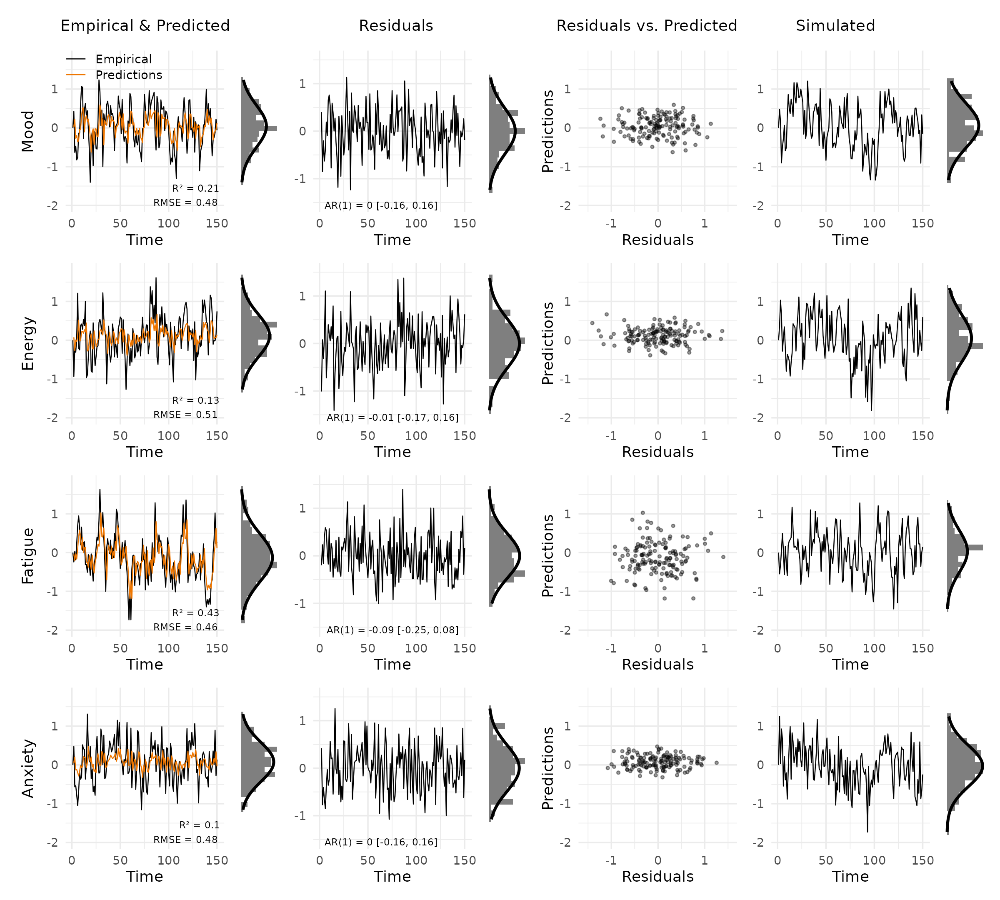
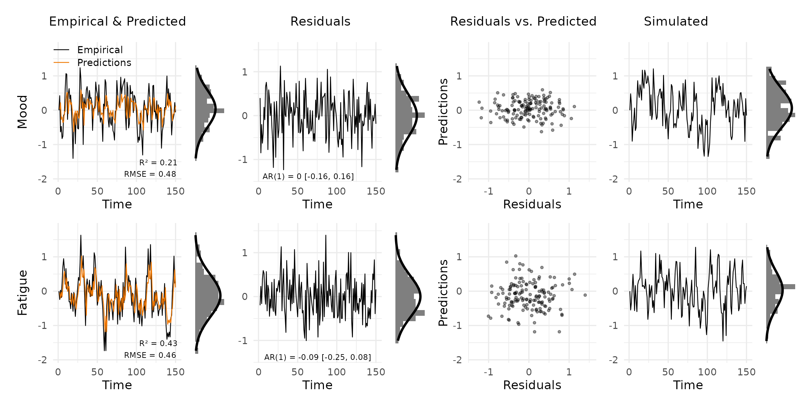
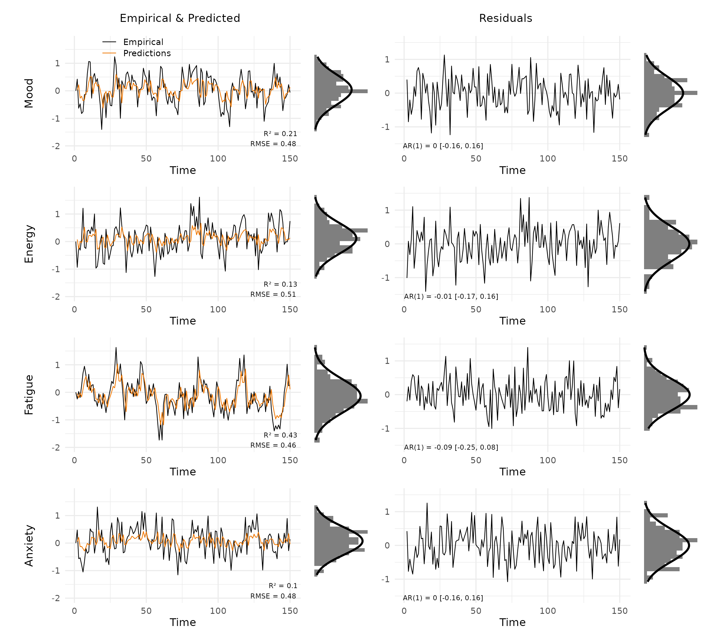
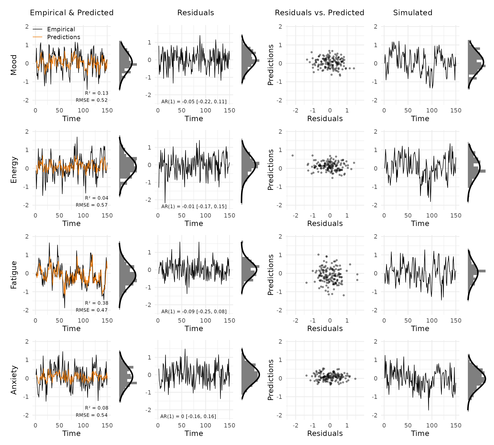
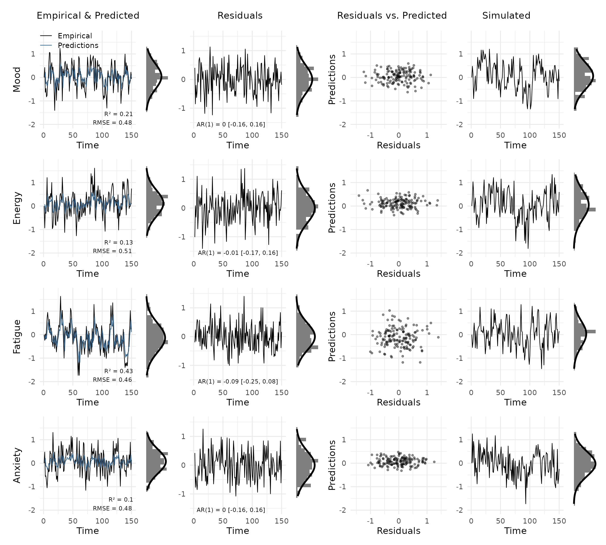
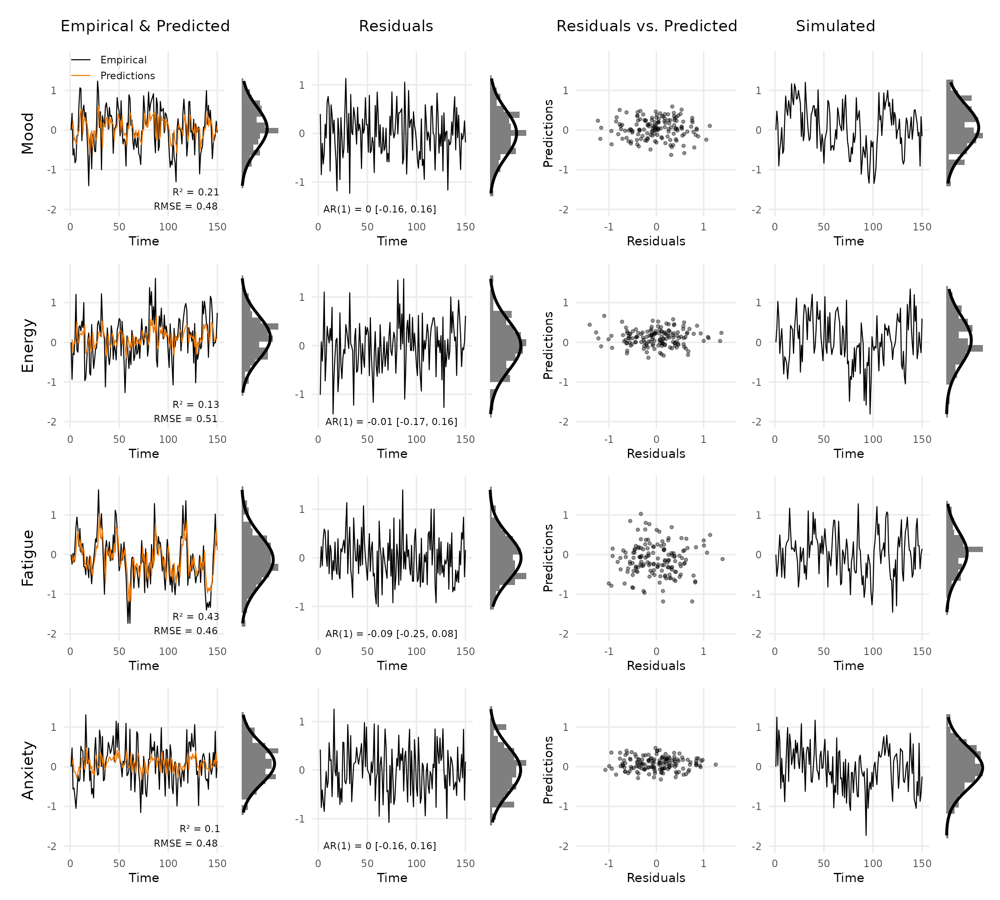
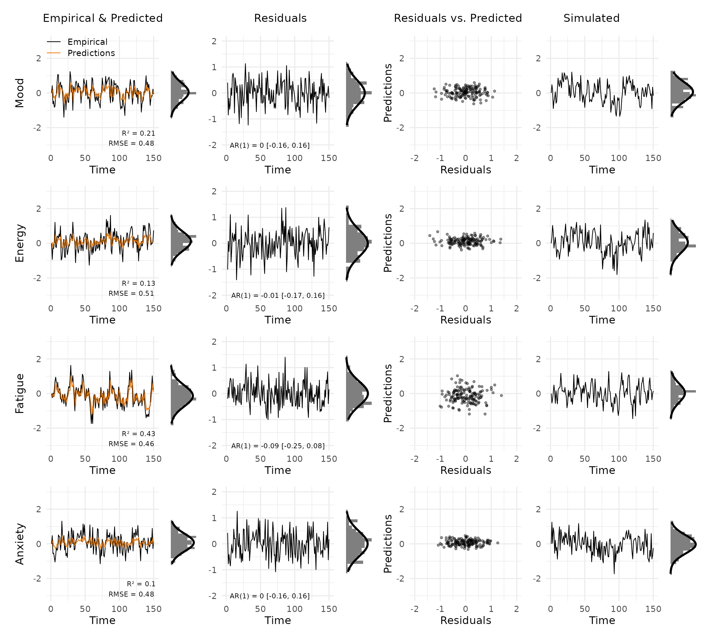

# Getting started

VARcheck visualises the fit of vector autoregressive (VAR) models
through a multi-panel diagnostic grid. The package does not fit models.
Instead, it takes the outputs of your existing workflow and turns them
into a structured plot.

## Setup

``` r
library(VARcheck)
set.seed(35032)
```

## Creating a `var_data` object

[`new_var_data()`](https://bsiepe.github.io/VARcheck/reference/new_var_data.md)
takes three required inputs (empirical data, model predictions, and
residuals), each as a `T × p` numeric matrix (time points × variables).
Simulated data for posterior predictive checks is optional but enables
the rightmost column of the diagnostic grid.

The example below simulates a simple two-variable VAR(1) process
directly, without any modelling package.

``` r
# Simulate a VAR(1) process
T  <- 150
p  <- 4
phi <- matrix(c(0.5, 0.1, 0.0, 0.0,
                0.2, 0.4, 0.0, 0.1,
                0.0, 0.0, 0.6, 0.0,
                0.1, 0.0, 0.2, 0.3), nrow = p, byrow = TRUE)

emp <- matrix(0, T, p)
for (t in 2:T) {
  emp[t, ] <- phi %*% emp[t - 1, ] + rnorm(p, sd = 0.5)
}

# Fit a simple lag-1 linear model per variable (stand-in for a real VAR fit)
pred <- matrix(NA, T, p)
res  <- matrix(NA, T, p)
for (j in seq_len(p)) {
  fit        <- lm(emp[-1, j] ~ emp[-T, j])
  pred[-1, j] <- predict(fit)
  res[-1, j]  <- residuals(fit)
}

# Simulate from the fitted model for the posterior predictive check
sim <- matrix(0, T, p)
for (t in 2:T) {
  sim[t, ] <- phi %*% sim[t - 1, ] + rnorm(p, sd = 0.5)
}
```

``` r
vd <- new_var_data(
  empirical  = emp,
  predicted  = pred,
  residuals  = res,
  simulated  = sim,
  var_names  = c("Mood", "Energy", "Fatigue", "Anxiety")
)

vd
#> <var_data>
#>   Subjects  : 1 
#>   Variables : 4 ( Mood, Energy, Fatigue, Anxiety )
#>   Timepoints  : 150 
#>   Components: empirical, predicted, residuals, simulated
```

## The diagnostic grid

[`plot_var_check()`](https://bsiepe.github.io/VARcheck/reference/plot_var_check.md)
returns a [patchwork](https://patchwork.data-imaginist.com/) object, so
it can be printed, saved with
[`ggplot2::ggsave()`](https://ggplot2.tidyverse.org/reference/ggsave.html),
or combined with other plots.

``` r
plot_var_check(vd)
```



Each row shows one variable. The columns are:

- **Empirical & Predicted**: observed values (black) against predictions
  (orange), with R² and RMSE in the bottom right. The small panel to the
  right is a marginal histogram with a Gaussian overlay.
- **Residuals**: residuals over time, annotated with the AR(1)
  coefficient and 95% CI to flag autocorrelation.
- **Residuals vs. Predicted**: scatter of residuals against predictions.
  A clear pattern here signals model misspecification.
- **Simulated**: data simulated from the fitted model, for visual
  comparison with the empirical series.

## Selecting variables and panels

Show only a subset of variables by name or index:

``` r
plot_var_check(vd, vars = c("Mood", "Fatigue"))
```



Drop columns you do not need. The layout adjusts automatically:

``` r
plot_var_check(vd, panels = c("data", "residuals"))
```



## Multiple subjects

When data comes from multiple people, pass a list of matrices (one per
subject) to
[`new_var_data()`](https://bsiepe.github.io/VARcheck/reference/new_var_data.md).
Use the `subject` argument to choose which one to plot.

``` r
emp2  <- emp + matrix(rnorm(T * p, sd = 0.2), T, p)
pred2 <- pred + matrix(rnorm(T * p, sd = 0.1), T, p)
res2  <- emp2 - pred2

vd_multi <- new_var_data(
  empirical = list(emp, emp2),
  predicted = list(pred, pred2),
  residuals = list(res, res2),
  simulated = list(sim, sim),
  var_names = c("Mood", "Energy", "Fatigue", "Anxiety")
)

plot_var_check(vd_multi, subject = 2)
```



## Customisation

**Colours**: pass a named list with `empirical` and/or `predicted` keys.
Unspecified keys retain their defaults.

``` r
plot_var_check(vd, colors = list(predicted = "steelblue4"))
```



**Theme**: the default is
[`theme_varcheck()`](https://bsiepe.github.io/VARcheck/reference/theme_varcheck.md).
Add any
[`ggplot2::theme()`](https://ggplot2.tidyverse.org/reference/theme.html)
call on top of it via the `theme` argument.

``` r
plot_var_check(
  vd,
  theme = ggplot2::theme(
    text      = ggplot2::element_text(size = 9, family = "sans"),
    panel.grid.minor = ggplot2::element_blank()
  )
)
```



**Shared y-limits**: by default, limits are computed across all selected
variables. Override them when comparing across subjects or model
variants.

``` r
plot_var_check(vd, ylim_data = c(-3, 3), ylim_res = c(-2, 2))
```



## Using mlVAR outputs

If you fit a model with
[mlVAR](https://cran.r-project.org/package=mlVAR), the
[`residuals()`](https://rdrr.io/r/stats/residuals.html) and
[`predict()`](https://rdrr.io/r/stats/predict.html) methods return
per-subject data frames. The code below shows how to assemble them into
a `var_data` object.
[`new_var_data()`](https://bsiepe.github.io/VARcheck/reference/new_var_data.md)
requires numeric matrices, so call
[`as.matrix()`](https://rdrr.io/r/base/matrix.html) on each data frame.

Assume you have already run:

``` r
library(mlVAR)

mlVAR_out <- mlVAR(data, vars = c("A", "B", "C", "D"),
                   idvar = "id", lags = 1,
                   dayvar = "day", beepvar = "beep")

pred_df <- predict(mlVAR_out)
res_df  <- residuals(mlVAR_out)
sim_out <- mlVAR:::resimulate(mlVAR_out, keep_missing = TRUE,
                              variance = "empirical")
```

**Single subject**

``` r
i <- 1  # subject index

vd <- new_var_data(
  empirical = as.matrix(data[data$id == u_ptp[i], vars]),
  predicted = as.matrix(pred_df[pred_df$id == u_ptp[i], vars]),
  residuals = as.matrix(res_df[res_df$id == u_ptp[i], vars]),
  simulated = as.matrix(sim_out[sim_out$id == u_ptp[i], vars])
)

plot_var_check(vd)
```

**All subjects**

Pass a list of matrices (one per subject) to plot any individual later
with `subject = i`.

``` r
vars     <- c("A", "B", "C", "D")
n_subj   <- length(u_ptp)

vd_all <- new_var_data(
  empirical = lapply(u_ptp, \(id) as.matrix(data[data$id == id, vars])),
  predicted = lapply(u_ptp, \(id) as.matrix(pred_df[pred_df$id == id, vars])),
  residuals = lapply(u_ptp, \(id) as.matrix(res_df[res_df$id == id, vars])),
  simulated = lapply(u_ptp, \(id) as.matrix(sim_out[sim_out$id == id, vars]))
)

plot_var_check(vd_all, subject = 3)
```
